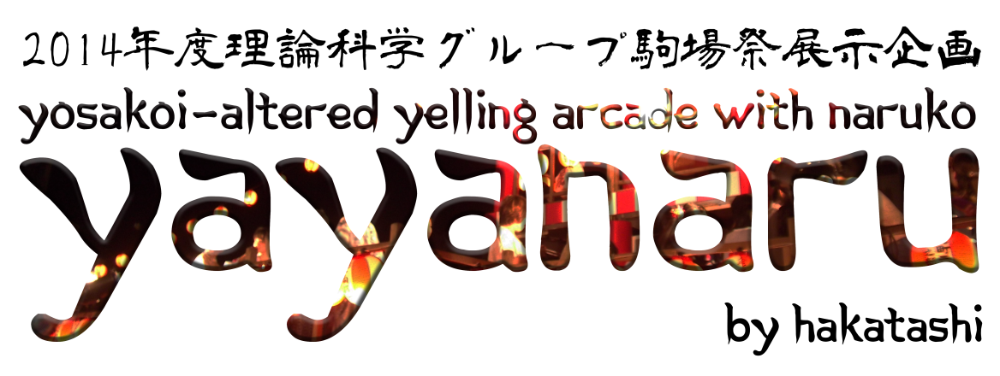
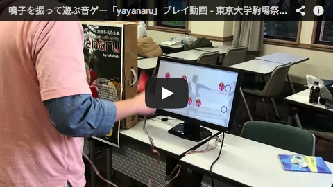
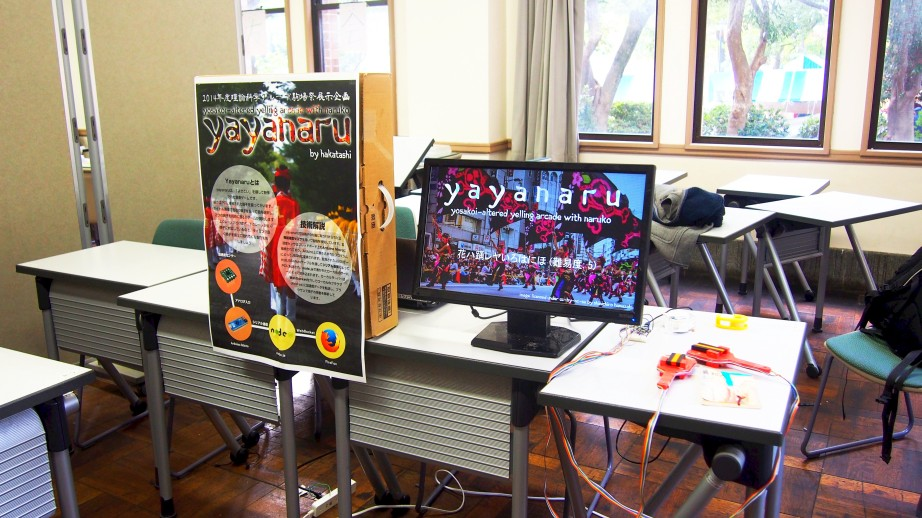
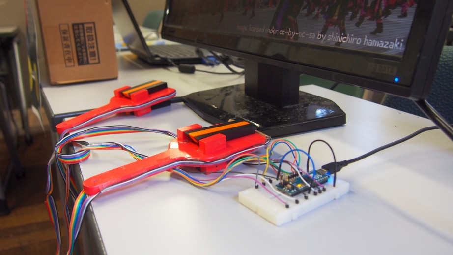
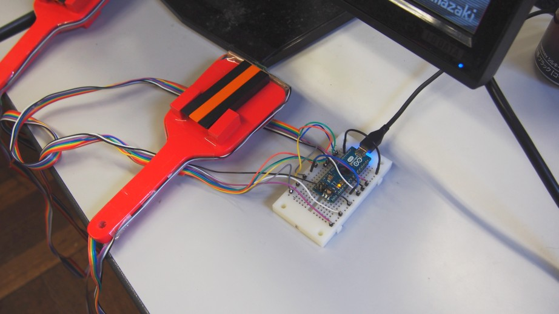
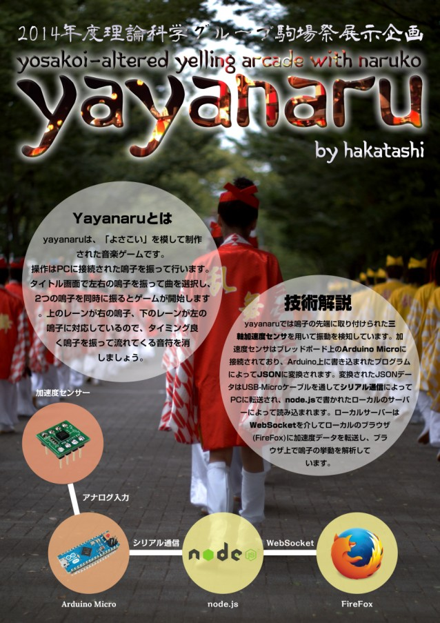

yayanaru is just the abbr of Yosakoi-Altered Yelling Arcade with NARUko, you know.

Check out video!

# Summary

yayanaru is music game developed toward the exhibition of [TSG](http://www.tsg.ne.jp/)
booth in [Komaba Festival 2014](http://www.komabasai.net/65/visitor/), which is
annual festival of the University of Tokyo.

What makes this game novel is that yayanaru uses
[naruko](http://en.wikipedia.org/wiki/Yosakoi#Costumes_and_naruko) to play.
Naruko is Japanese traditional percussion originally used in
[Yosakoi](http://en.wikipedia.org/wiki/Yosakoi).
Acceleration sensor equipped on the top of naruko perceives the emotion of
naruko and computer detects when the naruko was clapped.

User can play with perfectly engraphiced screen interface and claps naruko with
the timing of each notes emerges in the screen. From the user's voice, this is
incredibly fun!

# Photos

# Equipment

* [Arduino Micro](http://arduino.cc/en/Main/arduinoBoardMicro)
* [Acceleration Sensor KXSC7-2050](http://jp.kionix.com/accelerometers/kxsc7)
* [Naruko](http://www.amazon.co.jp/dp/B00EDXHZMQ)

# How it works

# License

All the code is licensed under [MIT License](http://mit-license.org/).

All the image is licensed under [CC BY-NC-SA 3.0](https://creativecommons.org/licenses/by-nc-sa/3.0/).
